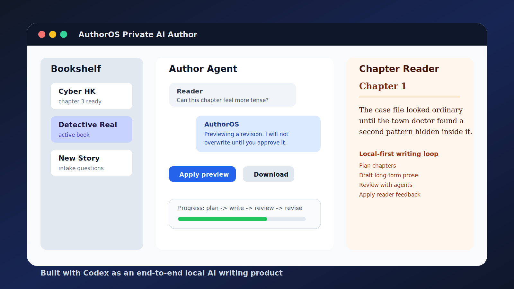

# AuthorOS

Chinese: [README.zh.md](README.zh.md)

**AuthorOS is a local-first AI author system for long-form fiction.** It treats a novel as a creative product: each book has positioning, worldbuilding, characters, chapter plans, drafts, internal reviews, reader feedback, decisions, and long-term memory.

The latest version adds a private web agent layer so a reader can open a browser, start a book, switch between books, continue chapters, read the latest chapter, give feedback, preview revisions, approve changes, and download chapters.



## Why It Matters

Most AI writing tools stop at prompt-to-text. AuthorOS is designed around the full writing loop:

- A book keeps its own identity, memory, and revision history.
- Long-form output is planned before it is drafted.
- Reader feedback is previewed before it changes canonical chapters.
- Multiple books can live in a private bookshelf and be switched without losing state.
- The CLI remains the durable core, while the web page provides a simple reader-facing experience.

## What The Private Web Agent Does

The web layer is a lightweight front desk for AuthorOS:

- Starts a local browser UI with `author web`.
- Protects the page with a temporary access token.
- Uses an Author Agent Controller to route chat messages.
- Asks intake questions before creating a vague new story.
- Shows progress events while long-running writing jobs execute.
- Supports chapter reading and Markdown/ZIP downloads.
- Routes explicit commands through local rules and vague feedback through a model-backed intent layer in `hybrid` mode.

## Quick Start

Requirements:

- Node.js 24 or newer.
- An OpenAI-compatible chat completion endpoint.
- Runtime dependency: `yaml`.

Clone and verify:

```bash
git clone https://github.com/nax-sec/AuthorOS.git
cd AuthorOS
npm install
npm test
npm run build
```

Configure model-backed commands:

```bash
export OPENAI_API_KEY="<key>"
export OPENAI_BASE_URL="https://api.openai.com/v1"
export AUTHOROS_MODEL="<model>"
```

Start the private web UI:

```bash
export AUTHOROS_PRIVATE_ROOT="$HOME/Books/authoros-web"
export AUTHOROS_WEB_TOKEN="<temporary-access-code>"
export AUTHOROS_WEB_AGENT="hybrid"

node src/cli.ts web --root "$AUTHOROS_PRIVATE_ROOT" --port 8787
```

Open:

```text
http://127.0.0.1:8787
```

For a temporary external demo:

```bash
cloudflared tunnel --url http://127.0.0.1:8787
```

## CLI Overview

AuthorOS can also be used directly as a CLI:

```bash
node src/cli.ts --help
node src/cli.ts author init
node src/cli.ts init "Detective Real" --concept "A forensic doctor investigates serial murders in a small town" --model --write
node src/cli.ts plan --chapter 1 --model --write
node src/cli.ts write --chapter 1 --model --write
node src/cli.ts review --chapter 1 --mode all --model --write
node src/cli.ts revise --chapter 1 --model --write
node src/cli.ts decide --chapter 1 --model --write
node src/cli.ts memory update --chapter 1 --model --write
```

Private bookshelf commands:

```bash
node src/cli.ts private new --title "Cyber HK" --concept "A cyberpunk detective story" --root "$AUTHOROS_PRIVATE_ROOT"
node src/cli.ts private list --root "$AUTHOROS_PRIVATE_ROOT"
node src/cli.ts private switch --book <book-id> --root "$AUTHOROS_PRIVATE_ROOT"
node src/cli.ts private continue --root "$AUTHOROS_PRIVATE_ROOT"
node src/cli.ts private read --chapter latest --root "$AUTHOROS_PRIVATE_ROOT"
node src/cli.ts private feedback --chapter latest --text "Make this chapter more tense" --root "$AUTHOROS_PRIVATE_ROOT"
node src/cli.ts private apply --root "$AUTHOROS_PRIVATE_ROOT"
```

## Architecture

```text
Reader browser
  -> AuthorOS local web server
  -> Author Agent Controller
  -> AuthorOS private bookshelf commands
  -> book files, chapters, reviews, decisions, and memory
```

Core paths:

- `src/cli.ts`: CLI entrypoint.
- `src/commands/`: AuthorOS command implementations.
- `src/web/`: private web server, web agent, downloads, jobs, and auth.
- `src/core/`: schemas, model client, agents, templates, and shared behavior.
- `tests/`: command, template, web, console, model, and workflow tests.

## Codex-Built Workflow

Codex was used as the main engineering partner to design and implement the project end to end. It helped build the TypeScript CLI, agent workflow, private web server, browser UI, tests, documentation, Git commits, and OpenAI Showcase submission package.

The private web agent feature was implemented iteratively with Codex: design spec, implementation plan, focused patches, test runs, commits, and GitHub push.

## Models And Providers

AuthorOS uses an OpenAI-compatible chat completion interface for model-backed author commands. It can be configured for OpenAI models with:

```bash
OPENAI_API_KEY=<key>
OPENAI_BASE_URL=https://api.openai.com/v1
AUTHOROS_MODEL=<model>
```

The local demo may also use non-OpenAI OpenAI-compatible providers. The provider is configurable and not hard-coded.

## Project Status

- Version: `0.3.6`.
- License: MIT.
- Tests: 209 passing tests at the time of the Showcase submission.
- Current focus: private AI author experience, reader feedback loop, and local-first long-form fiction workflows.

## Showcase Materials

- Submission draft: [docs/SHOWCASE.md](docs/SHOWCASE.md)
- Cover image: [docs/assets/showcase-cover.svg](docs/assets/showcase-cover.svg)
